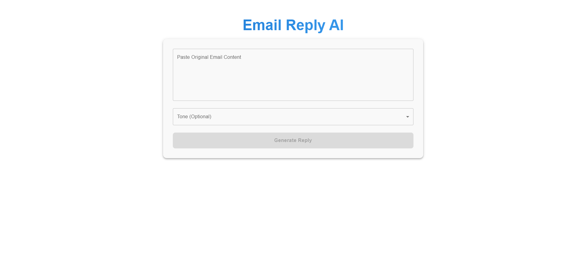
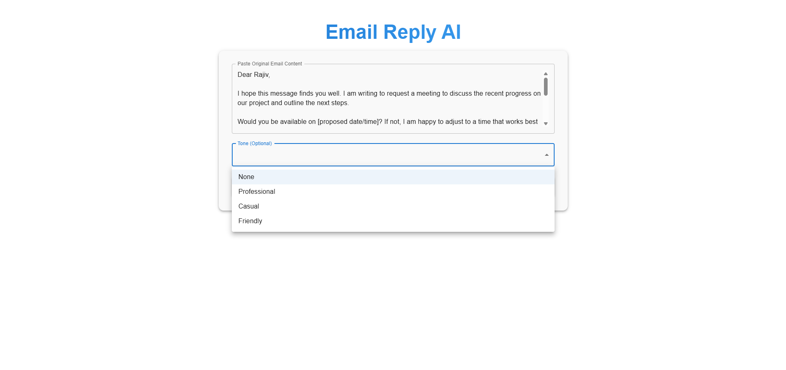

# Email Reply AI
An intelligent email reply generator that uses AI to craft professional responses based on the original email content and desired tone.


## Live Demo

**Frontend (React):**
👉 https://email-writer-frontend-9ysh.vercel.app/

## Screenshot





## Features
**Smart Reply Generation:** AI-powered email responses based on context

**Tone Selection:** Choose from Professional, Casual, or Friendly tones

**One-Click Copy**: Easily copy generated replies to clipboard

**Modern UI**: Beautiful, responsive interface built with Material-UI


## Project Structure
```
email-writer-frontend/
├── public/
│   └── vite.svg
├── src/
│   ├── assets/
│   │   └── react.svg
│   ├── App.css
│   ├── App.jsx          # Main application component
│   ├── index.css
│   └── main.jsx         # Application entry point
├── .gitignore
├── eslint.config.js
├── index.html
├── package.json
├── package-lock.json
└── vite.config.js
```
## Credits

Developed by Sumit Kumar Mandal

B.tech Computer Science and Engineering-2026

## License

This project is for education and personal use.
